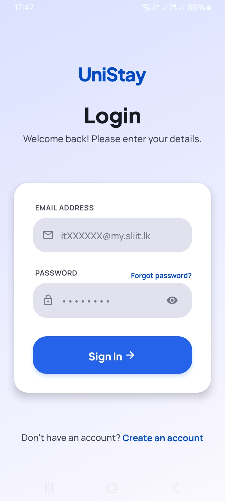

# UniStay - Hostel Management System

<p align="center">
  <em>A modern, unified platform for university accommodation operations.</em>
</p>

## 📖 Overview
**UniStay** is a comprehensive, mobile-first hostel management application designed to streamline and digitize university accommodation operations. It provides dedicated, role-based portals for students, managers, and security guards to handle room allocations, leave passes, attendance tracking, payments, and complaints efficiently. 

## 🤔 Problem Motivation
Traditional hostel management often relies on fragmented systems, paper-based registers, and manual processes. This leads to:
- **Inefficiency and Delays:** Paper-based leave passes take time to approve and verify.
- **Security Vulnerabilities:** Manual entry/exit logs are difficult to track in real-time, risking unauthorized access.
- **Communication Gaps:** Announcements and complaints are often missed, delayed, or poorly tracked.
- **Administrative Overhead:** Managing room allocations, inventory, and tracking fee payments manually is tedious and prone to human error.

**UniStay** bridges this gap by providing a unified, transparent, and secure digital platform for all stakeholders, saving time and ensuring a safer hostel environment.

## ✨ Features

### 🎓 For Students
- **Interactive Dashboard:** Quick overview of room status, recent announcements, and pending actions.
- **Digital Room Requests:** Apply for hostel rooms seamlessly and track the application status.
- **Leave Passes (Gate Pass):** Generate digital leave requests and view manager approval status instantly.
- **QR Code Attendance:** Unique, dynamically generated QR codes for secure, touchless entry/exit logging.
- **Complaints System:** Lodge maintenance or administrative issues and track their resolution status.
- **Payment Tracking:** View fee structures, submit payment proofs, and monitor payment history.

### 👨‍💼 For Managers (Admins)
- **Centralized Dashboard:** Monitor total student count, room occupancy rates, and pending administrative tasks.
- **Request Management:** Streamlined workflow to approve or reject room applications and leave passes.
- **Room & Inventory Management:** Create and manage room details, capacities, and direct student assignments.
- **Announcements:** Broadcast important notices and rules to all students instantly.
- **Complaint Resolution:** Track, update, and resolve student complaints efficiently.
- **Financial Monitoring:** Oversee student payments, verify receipts, and manage dues.

### 🛡️ For Security Guards
- **Integrated QR Scanner:** Built-in camera scanner to verify student identities and log entry/exit automatically.
- **Live Attendance Dashboard:** View real-time scan metrics, current day's entry and exit logs, and active leave pass validations.
- **Strict Entry/Exit Logic:** State-based validation to prevent redundant or unauthorized scans (e.g., cannot exit twice consecutively).

## 👥 System Roles
1. **Student:** End-users residing in the hostel requiring accommodation services.
2. **Manager (Admin):** Administrators responsible for operational, financial, and facility management.
3. **Guard:** Security personnel managing physical access, verifying passes, and taking attendance at the gates.

## 🛠️ Tech Stack

### Frontend (Mobile App)
- **Framework:** React Native with Expo
- **Navigation:** Expo Router
- **State Management:** React Context API & AsyncStorage
- **UI & Styling:** Native styling, Expo Google Fonts, Expo Glass Effect
- **Camera/Scanner:** Expo Camera

### Backend (Server)
- **Runtime:** Node.js
- **Framework:** Express.js
- **Authentication:** JSON Web Tokens (JWT) & bcrypt (Password hashing)
- **File Storage:** Cloudinary & Multer (For receipt/image uploads)
- **Utilities:** QR Code generator, UUID

### Database
- **Database:** MongoDB
- **ODM:** Mongoose

## 📂 Project Structure

```text
UniStay App/
│
├── backend/                  # Node.js Express Server
│   ├── src/
│   │   ├── config/           # Database and third-party configuration
│   │   ├── controllers/      # Route controllers (business logic)
│   │   ├── middleware/       # JWT auth, Multer, error handling
│   │   ├── models/           # Mongoose database schemas
│   │   ├── routes/           # Express API endpoints
│   │   ├── services/         # Reusable business logic services
│   │   └── utils/            # Helper functions
│   ├── .env                  # Environment variables (not committed)
│   ├── server.js             # Application entry point
│   └── package.json          # Backend dependencies
│
└── unistay-app/              # React Native Expo Application
    ├── app/                  # Expo Router file-based routing
    ├── assets/               # Static assets (images, fonts, icons)
    ├── components/           # Reusable UI components
    ├── constants/            # Theme, colors, and layout definitions
    ├── context/              # Global React Context providers
    ├── hooks/                # Custom React hooks
    ├── services/             # API client and networking logic
    ├── utils/                # Helper functions and formatters
    ├── app.json              # Expo project configuration
    └── package.json          # Frontend dependencies
```

## 📸 Screenshots

### Authentication & Navigation
| Login | Sign Up | Side Menu |
| :---: | :---: | :---: |
|  |  |  |

### Student Portal
| Student Dashboard | Student QR | Leave Passes |
| :---: | :---: | :---: |
|  |  |  |

### Manager & Guard Portals
| Manager Dashboard | Guard Dashboard | Guard Scanner |
| :---: | :---: | :---: |
|  |  |  |

### Features
| Rooms | Complaints | Announcements |
| :---: | :---: | :---: |
|  |  |  |


## 🚀 Setup Instructions

### Prerequisites
- Node.js (v18+)
- MongoDB (Local instance or MongoDB Atlas)
- Expo CLI (`npm install -g expo-cli`)
- Expo Go app on your physical device (or iOS/Android emulator)

### 1. Clone the Repository
```bash
git clone https://github.com/HarshaJayaweera21/UniStay-Mobile-App.git
cd UniStay-Mobile-App
```

### 2. Backend Setup
1. Navigate to the backend directory:
   ```bash
   cd backend
   ```
2. Install dependencies:
   ```bash
   npm install
   ```
3. Create a `.env` file in the `backend` root and configure the following variables:
   ```env
   PORT=5000
   MONGODB_URI=your_mongodb_connection_string
   JWT_SECRET=your_jwt_secret_key
   CLOUDINARY_CLOUD_NAME=your_cloudinary_name
   CLOUDINARY_API_KEY=your_cloudinary_key
   CLOUDINARY_API_SECRET=your_cloudinary_secret
   ```
4. Start the development server:
   ```bash
   npm run dev
   ```

### 3. Frontend Setup
1. Navigate to the mobile app directory:
   ```bash
   cd unistay-app
   ```
2. Install dependencies:
   ```bash
   npm install
   ```
3. Create a `.env` file in the `unistay-app` root with your backend URL (use your machine's local IP address if testing on a physical device):
   ```env
   EXPO_PUBLIC_API_URL=http://<YOUR_LOCAL_IP>:5000/api
   ```
4. Start the Expo development server:
   ```bash
   npx expo start
   ```
5. Scan the generated QR code using the Expo Go app on your phone, or press `a` to open in Android Emulator / `i` for iOS Simulator.
